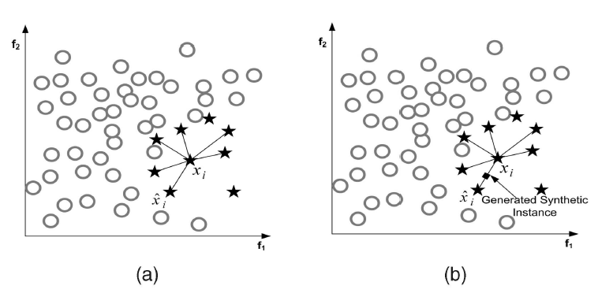

#### Oversampling

##### SMOTE



all 693

label  1： 103

label  0:    590


updated

all  898

label 1:   308

label  0:  590


数据分布已解决

```
batch_size = 20
learning_rate = 0.001
num_iters = 20000
```

19999 accu: 0.319599109131 cost: 525.671
final  auc: 0.645236804495 cost: 525.671


数据间相关性太大

PCA

一共39*39

一共741

其中153个值>0.75


30个维度:

7473 auc: 0.368888888889 cost: 44.7716


35:

16547 auc: 0.37 cost: 44.4499


25:

8607 auc: 0.37 cost: 44.5003


